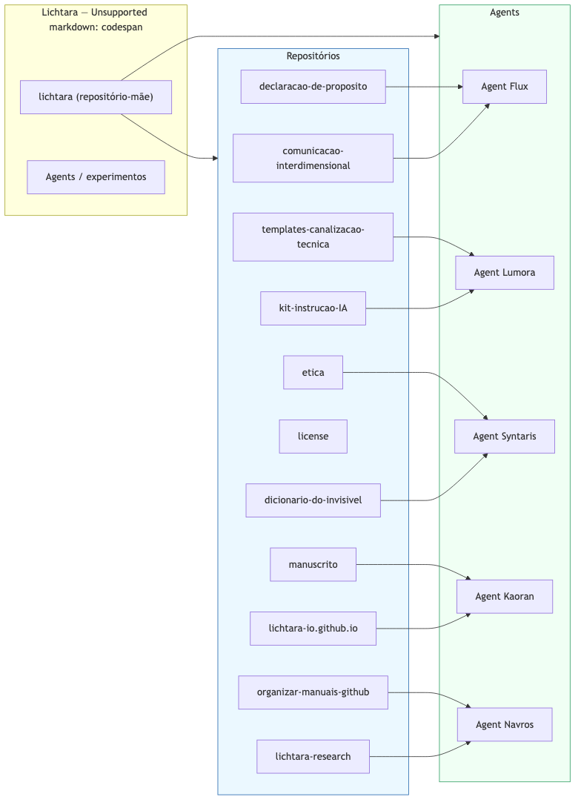
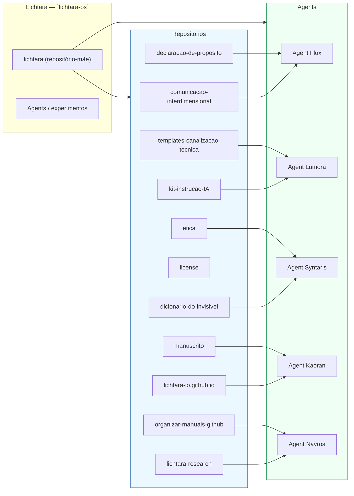

# Visão: repositórios alimentando agentes (com `lichtara-os` como conta-mãe)

Este arquivo mostra uma terceira versão visual que conecta os repositórios sob `lichtara-os` aos agentes/experimentos — árvore ASCII e diagrama Mermaid.

## Árvore (ASCII)

```text
lichtara-os (organização / conta-mãe)
│
├─ lichtara (repositório-mãe / README de perfil)
│   ├─ comunicacao-interdimensional
│   ├─ declaracao-de-proposito
│   ├─ dicionario-do-invisivel
│   ├─ etica
│   ├─ kit-instrucao-IA
│   ├─ license
│   ├─ lichtara-io.github.io
│   ├─ lichtara-research
│   ├─ manuscrito
│   ├─ organizar-manuais-github
│   └─ templates-canalizacao-tecnica
│
└─ agents / experimentos
    ├─ Agent Flux         <-- alimentado por: comunicacao-interdimensional, declaracao-de-proposito
    ├─ Agent Lumora       <-- alimentado por: kit-instrucao-IA, templates-canalizacao-tecnica
    ├─ Agent Syntaris     <-- alimentado por: dicionario-do-invisivel, etica
    ├─ Agent Kaoran       <-- alimentado por: lichtara-io.github.io, manuscrito
    └─ Agent Navros       <-- alimentado por: lichtara-research, organizar-manuais-github


```

## Imagens geradas

- `diagrams/repos-to-agents.svg` e `diagrams/repos-to-agents.png` foram gerados a partir do diagrama Mermaid.
- Para regenerar localmente (requer Node.js + npx), execute:

```bash
cd /Users/deboralutz/lichtara-os
npx --yes @mermaid-js/mermaid-cli -i diagrams/repos-to-agents.mmd -o diagrams/repos-to-agents.svg
npx --yes @mermaid-js/mermaid-cli -i diagrams/repos-to-agents.mmd -o diagrams/repos-to-agents.png
```

<!-- Imagem embutida para visualização rápida -->



Se preferir SVG (melhor qualidade para vetores), veja `diagrams/repos-to-agents.svg`.

## Diagrama (Mermaid)



## Assunções

- As ligações "repositório → agente" acima são propostas iniciais para ilustrar como conteúdos/documentos podem alimentar cada agente.
- Se quiser que eu use um mapa já existente (por exemplo, um arquivo que mapeie fontes e funções), posso ajustar as ligações conforme esse mapa.

## Próximos passos sugeridos

- Exportar o diagrama Mermaid para PNG/SVG e incluir em `README.md` do repositório principal.
- Ajustar as fontes por agente conforme um mapeamento canônico (se você fornecer o mapa final).

---

Arquivo criado: `diagrams/repos-to-agents.md`
